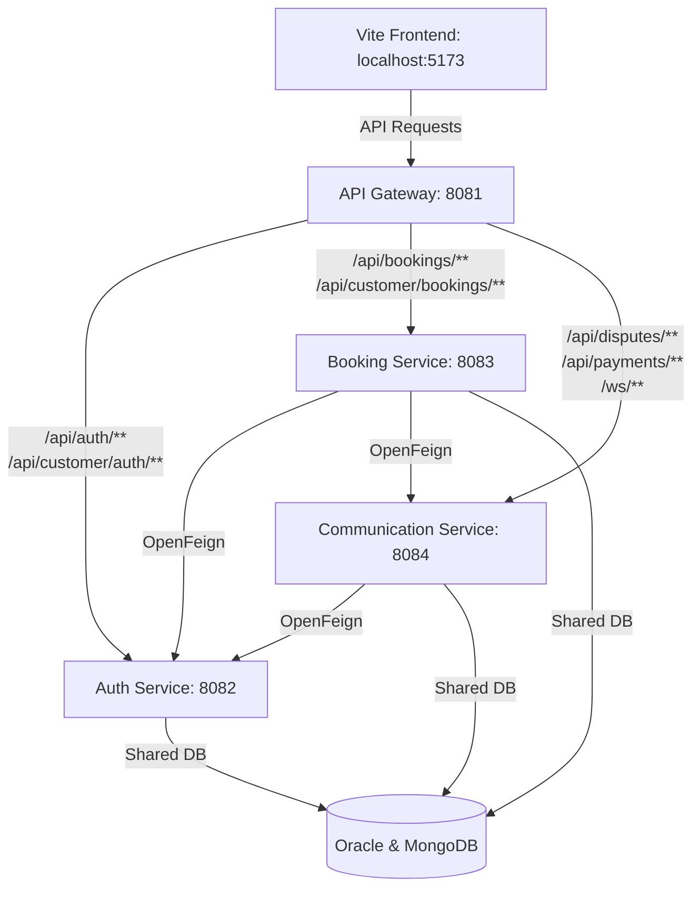

# HandyServe Microservices Architecture

This directory contains the migrated backend code for HandyServe, transitioned from a monolithic Spring Boot application to a multi-module Maven microservices architecture.

---

## Architecture Design



### Key Modules

1. **`common`**: Shared Library. Includes all shared request/response DTOs, custom exception classes, and utility classes. Builds as a regular JAR and is imported by other services.
2. **`auth-service` (Port 8082)**: Handles user registrations, logins, verification tokens, customer authentication, security seeder, and issuing JWTs.
3. **`booking-service` (Port 8083)**: Manages bookings, leave requests, provider schedules, geocoding coordinates lookup, customer discovery/tracking dashboards, and provider search.
4. **`communication-service` (Port 8084)**: Handles real-time chats (`/ws`), notifications, support disputes, contact requests, and payment processing.
5. **`api-gateway` (Port 8081)**: Orchestrates routing for all incoming frontend/external traffic. Proxies routes to corresponding microservices. Runs on **port 8081** so that frontend configurations do not need to change.

---

## Database Strategy
All three business microservices connect to the same **Oracle Schema (`HANDYSERVE`)** and **MongoDB Database (`handyserve`)**.
- This enables fast startup, database-level schema constraints, and seamless integration without data migration.
- When a service requires information from another service's "owned" table, it maps a **read-only skeleton entity** locally (e.g. `booking-service` maps a skeleton `User` entity to query user profiles, bypassing the network overhead of constant Feign HTTP requests).

---

## Running the Services

### 🚀 Quick Start (Recommended)
You can boot all services in the proper sequence using the PowerShell script:

1. Open PowerShell in `backend-java`
2. Run:
   ```powershell
   ./start-services.ps1
   ```
   *This script will verify built JAR files, kill any old running instances on service ports, and start all services in separate, labeled windows with proper initial start delays.*

3. To stop all running services:
   ```powershell
   ./stop-services.ps1
   ```

### 🛠️ Manual Execution
If you prefer running services manually, boot them in this sequence:

```bash
# 1. Build project
..\apache-maven-3.9.9\bin\mvn.cmd clean install -DskipTests

# 2. Start Auth Service (Port 8082)
java -jar auth-service/target/auth-service-1.0.0.jar

# 3. Start Communication Service (Port 8084)
java -jar communication-service/target/communication-service-1.0.0.jar

# 4. Start Booking Service (Port 8083)
java -jar booking-service/target/booking-service-1.0.0.jar

# 5. Start API Gateway (Port 8081)
java -jar api-gateway/target/api-gateway-1.0.0.jar
```

---

## Routing & Ports Table

| Module | Host Port | Routing Context Path | Direct Testing Endpoint |
|---|---|---|---|
| **API Gateway** | `8081` | `/` (Acts as Router) | `http://localhost:8081/` |
| **Auth Service** | `8082` | `/api/auth/**`, `/api/customer/auth/**` | `http://localhost:8082/api/auth/login` |
| **Booking Service** | `8083` | `/api/bookings/**`, `/api/customer/bookings/**` | `http://localhost:8083/api/bookings` |
| **Communication Service** | `8084` | `/api/payments/**`, `/ws/**`, `/api/disputes/**` | `http://localhost:8084/api/payments` |

---

## OpenFeign Communication Mesh

We use OpenFeign client bindings to coordinate business flows across service boundaries. For example:
- `booking-service` calls `auth-service` at `/api/internal/users/{id}/update-stats` when a booking is finished/updated to increment client/provider transaction statistics.
- `booking-service` calls `communication-service` at `/api/internal/ws/broadcast` to send real-time WebSocket state updates to the browser.
